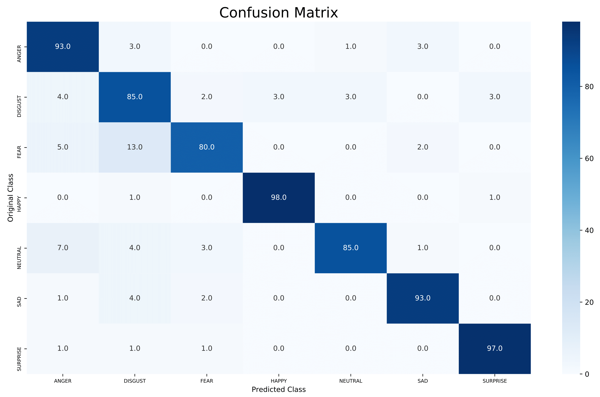

# Thesis
3D facial reconstruction, expression recognition and transfer from monocular RGB images with a deep convolutional auto-encoding neural network

## Abstract
The present work implements an automatic system for coding and reconstructing 3D faces from low resolution RGB images by utilizing machine learning algorithms.
Given a 3D morphable model, different faces are represented as a vector of variables ("code vector") which describe the shape, expression and color of the face. The multiplication of these parameter vectors with the PCA bases provided by the morphable model results in the 3D coordinates of the reconstructed face.
As part of this work, an algorithm for the creation of two-dimensional synthetic faces solely from the information captured by the code vector was developed. The synthetic faces were used to train the neural network that acts as the encoding phase of the auto-encoding system and bootstrapping techniques were used to generalize the network to real-world facial images.

The outcome of this work is not only proof of the potential of 3D facial reconstruction from RGB images, but also the ability to exploit the 3D face by changing its expression, color or lighting. In the context of said exploitation, a neural network was implemented to identify the facial expression from the information encoded in the code vector.
The problem tackled by the present work has until now been solved by the use of iterative algorithms based on the linear combination of existing prototype samples, which require a large amount of data from three-dimensional scans. Here, an attempt is made to solve this problem purely with machine learning and synthetic data.

## Results
#### Autoencoding network for 3D reconstruction
Below are the results of the 3D reconstruction auto-encoding network:
- A comparison between the results of Xception, ResNet50 and InceptionV3 architectures. Image (i.) shows the original face and images (ii.) - (iv.) depict the reconstructions with Xception, ResNet50 and InceptionV3, respectively.

 

- A comparison between the reconstructions of ResNet50 at 4 different stages of the training. Image (i.) shows the original face, image (ii.) shows the initial reconstruction by a ResNet50 encoder and images (iii.) - (iv.) show the reconstructions after each bootstrapping iteration.

 

#### Facial expression recognition network
Below are the results of the 2-hidden-layer expression classification network.

- The network can classify between 7 different expressions, namely anger, disgust, fear, happiness, neutral, sadness and surprise.
The images below depict the base expressions that were used as a reference when creating the synthetic dataset.


- The matrix (CM) shows the accuracy of the network on 700 real faces from [The MUG Facial Expression Database](https://mug.ee.auth.gr/fed/).
The network was trained on synthetic data.
 


## Dependencies
```
pip install -r requirements.txt
```

## Data Dependencies
The following files have to be downloaded and placed on the _./DATASET_ directory
* **[The Basel Face Model](http://gravis.dmi.unibas.ch/PMM/data/overview/)** 
: a simple viewer of the model is available _[here](https://github.com/unibas-gravis/basel-face-model-viewer)_
* **[dlib's Landmark Predictor](https://github.com/davisking/dlib-models)** : shape_predictor_68_face_landmarks.dat
* **[OpenCV's Frontal Face Detector](https://github.com/opencv/opencv/blob/master/data/haarcascades/haarcascade_frontalface_default.xml)** : haarcascade_frontalface_default.xml

For validation on real faces:
* **[The MUG Facial Expression Database](https://mug.ee.auth.gr/fed/)**

## Bugs & Request
Please report bugs and request features using the [Issue Tracker](https://github.com/anapt/thesis/issues).
